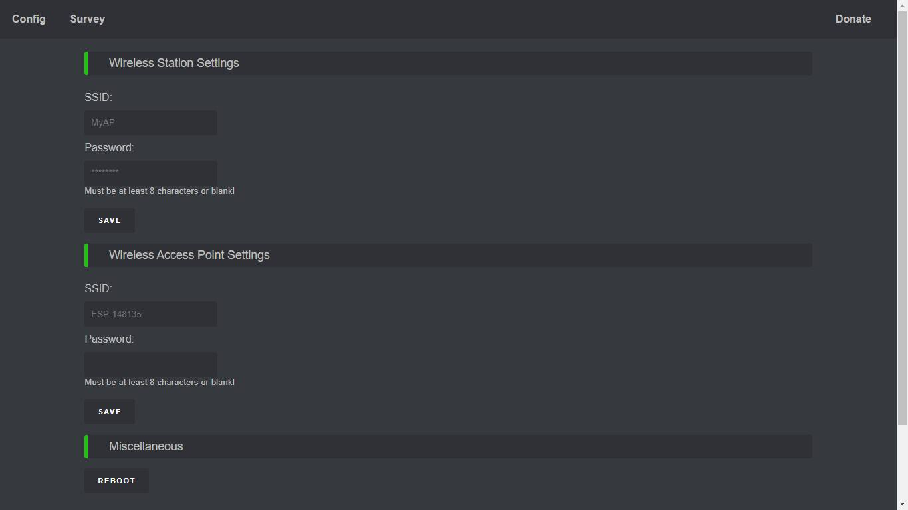
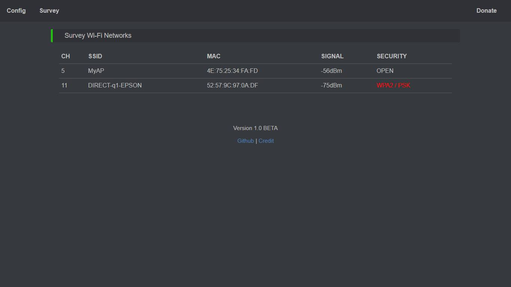

# ESP8266-Range-Extender-GUI
A wireless repeater (also called wireless range extender or wifi extender) is a device that takes an existing signal from a wireless router or wireless access point and rebroadcasts it to create a second network. When two or more hosts have to be connected with one another over the IEEE 802.11 protocol and the distance is too long for a direct connection to be established, a wireless repeater is used to bridge the gap. It can be a specialized stand-alone computer networking device. Also, some wireless network interface controllers (WNIC)s optionally support operating in such a mode. Those outside of the primary network will be able to connect through the new "repeated" network. However, as far as the original router or access point is concerned, only the repeater MAC is connected, making it necessary to enable safety features on the wireless repeater. Wireless repeaters are commonly used to improve signal range and strength within homes and small offices.
## Donation
If this project help you reduce time to develop, you can give me a cup of coffee :) 

Typical usage scenarios include:

Simple range extender for an existing WiFi network
Battery powered outdoor (mesh) networks
Setting up an additional WiFi network with different SSID/password for guests
Setting up a secure and restricted network for IoT devices
Translating WPA2 Enterprise networks to WPA-PSK
Monitor probe for WiFi traffic analysis
Network experiments with routes, ACLs and traffic shaping
Meshed IoT device with basic I/O capabilities and MQTT control
By default, the ESP acts as STA and as soft-AP and transparently forwards any IP traffic through it. As it uses NAT no routing entries are required neither on the network side nor on the connected stations. Stations are configured via DHCP by default in the 192.168.4.0/24 net and receive their DNS responder address from the existing WiFi network.

Measurements show, that it can achieve about 5 Mbps in both directions, so even streaming is possible.

Flashing Tool:https://www.espressif.com/en/support/download/other-tools

# Screenshooots

# Booting ES8266 First Time
The ESP8266-Range-Extender-GUI starts with the following default configuration:

SSID: ESP-148135
Password: none
Network: 192.168.0.254
After first boot (or factory reset) it will offer a WiFi network with an open AP and the ssid "ESP-148135". It does not yet try to automatically re-connect to an uplink AP (as it does not know a valid ssid or password).

Connect to this WiFi network and do the basic configuration either via a simple web interface.
